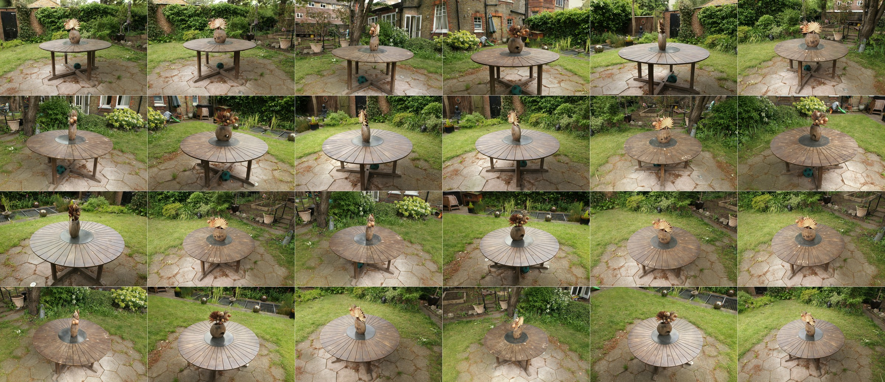

# GANG-Jittor-Render：基于计图的场景级神经高斯可重光照渲染器

本项目将 GANG（Geometrically-Aligned Neural Gaussians）的核心推理管线迁移至计图（Jittor）。完成 checkpoint 格式转换后，Jittor 推理运行时不依赖 PyTorch。Garden 40K 模型在固定的 `res=4`、24 个测试视角和 PBR + 16 SG 配置下，与 PyTorch 参考输出达到 33.92 dB PSNR 和 0.9951 SSIM；该结论只适用于下文记录的固定实验基线。


公开工具包含两类用途：复现已转换 PyTorch checkpoint 的兼容渲染，以及只替换环境贴图的受控重光照。核心源码仍保留默认关闭的实验性点光源和阴影分支，但阶段性研究脚本没有纳入发布目录；这部分不属于公开复现入口。

下图汇总 Garden 40K 模型在 `res=4` 下的 24 个测试视角，用于展示视角覆盖和整体重建效果；它不属于 Envmap 单变量对照实验。



---

## Part 1 GANG：从 3DGS 到场景级可重光照

### 1.1 面向复杂真实场景的可重光照表示

三维高斯泼溅（3DGS）用大量椭球状高斯基元表示场景，在新视角合成中具有较高效率，但常规表示直接学习与视角相关的颜色，难以显式分离几何、材质和光照。场景重光照还需要处理尺度大、物体类型多、材质变化复杂和局部几何不稳定等问题。

GANG 将锚点式神经高斯表示与物理着色结合，用紧凑锚点特征解码几何和材质属性，并以混合光照模型描述全局环境光与局部直接光，从而支持复杂真实场景的重建和重光照。


### 1.2 GANG 渲染管线

GANG 通过锚点组织场景。每个锚点保存紧凑的潜在特征，多个轻量级 MLP 从中解码 K 个神经高斯，输出位置、旋转、缩放、不透明度、颜色，以及反照率（albedo）、粗糙度（roughness）和金属度（metallic）等 PBR 属性。

论文的效率实验表明，与 R3DG 相比，GANG 在三个数据集上的模型存储量平均约为其 1/25。该比例来自论文表 III 的特定基线比较，不代表对所有 3DGS 方法的普遍压缩比例。

材质着色采用 Cook–Torrance 微表面 BRDF，并分别计算漫反射和镜面反射。可学习 cubemap 提供全局环境光；位置可学习的球面高斯（SG）描述局部直接光，产生方向性高光和局部明暗变化。标准 SG 路径不计算遮挡可见性，因此不应将其描述为具有物理阴影。


---

## Part 2 Jittor 推理管线的实现

### 2.1 复用 JGaussian 的基础组件

GANG-Jittor-Render 在两处复用了 JGaussian 的基础实现。光栅化层面沿用其 CUDA 高斯光栅器的结构与前向接口，并扩展 GANG 所需的材质和诊断通道。训练路径按需保留 Tape 与梯度回调；当前推理路径直接调用 CUDA forward，不建立 Tape，也不保留反向缓存。

光照层面以 JGaussian 的环境光组织方式、cubemap 采样接口和 FG_LUT 分裂求和积分为基础，接入 GANG 的锚点式材质解码、可学习 envmap 与位置 SG。cubemap 采样随后改写为纯 Jittor 实现，消除了该环节对 nvdiffrast 的运行依赖；CUDA 高斯光栅库仍需从仓库源码编译。

### 2.2 锚点式 PBR 解码

Jittor 实现保留了 GANG 的锚点结构。锚点特征与视线方向、距离和层级信息组合后，分别进入几何与材质解码器。几何组输出不透明度、颜色和协方差，并由缩放与旋转推导法线；材质组输出反照率、粗糙度和金属度。解码后的神经高斯直接进入光照计算与光栅化。

### 2.3 推理专用光栅前向

光栅化部分复用 JGaussian 的 CUDA 光栅器结构和前向接口。当前推理路径直接调用 CUDA forward，不建立 Tape，也不保留反向传播缓存；Tape 和梯度回调只服务训练路径。推理专用分支还会在前向结束后释放 Geometry、Binning 和 Image scratch buffer 的 Python 引用，避免多视角渲染累积上一帧的缓存。

### 2.4 混合光照

本项目验证的 Garden 40K checkpoint 使用一个可学习 cubemap 和 16 个位置 SG。cubemap 经预积分得到漫反射 irradiance 与镜面反射 mipmap；SG 根据波瓣方向、锐度、强度和位置计算局部直接光的漫反射与镜面反射，并可使用训练时的距离权重。

SG 本身没有深度或透射率查询。当前代码中的阴影来自独立的实验性点光源路径，默认关闭，不属于论文 SG 基线。


### 2.5 纯 Jittor cubemap 采样

PyTorch 原版使用 nvdiffrast 完成二维纹理和 cubemap 采样。当前实现以 Jittor 的 `grid_sample` 替代这部分功能，覆盖二维纹理、cubemap 单级采样和 cubemap mipmap 三线性采样，因此环境贴图路径不再依赖 nvdiffrast。

这一改动只消除了纹理采样对 nvdiffrast 的依赖。整个渲染器仍需从 `submodules/light_gaussian/` 编译 CUDA 光栅库 `librasterizer.so`；仓库不提交平台相关的预编译动态库。

### 2.6 SG 数值精度

SG 波瓣卷积包含相近浮点数相减。粗糙度较低时，锐度参数会放大 float32 舍入误差。当前实现只将波瓣组合和最终半球积分中的关键相消项提升为 float64，随后把结果转回 float32。

局部双精度没有改变模型参数和最终张量的存储精度，相较全 float32 链路不会降低输出精度。它用于降低相消误差。当前仓库尚未提供单独的 float32/float64 耗时对照，因此不对性能开销作定量结论。

### 2.7 显存管理

当前推理路径采用三类显存控制措施：

- 在非 PBR MLP 与材质 MLP 之间同步并回收懒执行图；
- 使用无 Tape 的推理专用光栅前向，并释放光栅 scratch buffer 引用；
- 在 SG 镜面、漫反射和 envmap 阶段之间显式释放大尺寸中间张量。

这些措施用于控制多 MLP、数百万神经高斯和高分辨率光栅化共同产生的峰值显存。若需公开显存结论，应同时报告模型、分辨率、视角数、显卡、光照模式和完整进程峰值，避免把单一阶段的显存增量写成整条管线的峰值。

---

## Part 3 固定基线下的 Jittor–PyTorch 一致性


以下结果来自 Garden 场景的固定实验产物。Jittor 与 PyTorch 使用各阶段对应的模型状态和同一组相机，在 `res=4` 下渲染 24 个测试视角。

| 指标 | 0K（随机初始化） | 25K（几何阶段） | 40K（PBR 阶段） |
|------|:---:|:---:|:---:|
| 渲染模式 | 非 PBR | 非 PBR | PBR + 16 SG |
| 平均 PSNR | 26.76 dB | **48.33 dB** | **33.92 dB** |
| 平均 SSIM | 0.8950 | **0.9998** | **0.9951** |
| JT/PT 亮度比 | 0.9696 | 0.9978 | 1.021 |
| 报告记录的误差阈值通过率 `<0.05` | 83.3% | 接近 100.0% | 94.5% |
| 报告记录的误差阈值通过率 `<0.10` | 94.8% | 接近 100.0% | 99.6% |

表中只呈现 24 个测试视角的平均结果。0K、25K 与 40K 数据均来自迁移期间保存的固定实验基线，不用于说明其他配置或实验分支的一致性。

25K 非 PBR 路径与 PyTorch 输出接近。40K 启用材质解码、cubemap、SG 和 BRDF 后，仍保持 33.92 dB PSNR 和 0.9951 SSIM。该结果支持固定配置下的高度一致，不表示数组逐元素完全相同，也不覆盖单位法线重光照、点光源、阴影或其他实验分支。

---

## Part 4 重建质量与 Envmap 重光照

Part 3 的 Jittor–PyTorch 对比检验迁移一致性。本节的 Jittor–GT 指标衡量模型对真实观测图像的重建质量；固定场景后替换 envmap 的实验检验光照可编辑性。三类结果回答的问题不同。

### 4.1 Jittor 与 GT 的三阶段重建质量

在 Garden 场景、`res=4` 和相同的 24 个测试视角下，得到以下平均结果：

| 指标 | 0K（随机初始化） | 25K（几何阶段） | 40K（PBR 阶段） |
|------|:---:|:---:|:---:|
| 渲染模式 | 非 PBR | 非 PBR | PBR + 16 SG |
| 平均 PSNR | 11.30 dB | **28.12 dB** | **25.62 dB** |
| 平均 SSIM | 0.1455 | **0.8867** | **0.8652** |
| JT/GT 亮度比 | 0.677 | 0.993 | 1.045 |
| 历史报告阈值通过率 `<0.05` | 0.87% | 79.76% | 61.53% |
| 历史报告阈值通过率 `<0.10` | 5.86% | 95.87% | 91.48% |

25K 与 40K 使用不同渲染模式。25K 直接检验几何和颜色重建；40K 增加材质、环境光和 16 个 SG 的完整 PBR 计算。因此，两列不能用于单变量训练轮次排序，迁移正确性仍由同 checkpoint、同相机条件下的 Jittor–PyTorch 对比衡量。

### 4.2 只替换 Envmap 的 Garden 对照实验

每组 A/B 实验固定以下条件；14 个 envmap 各自在独立进程中运行：

- A/B 两侧使用同一 Garden 40K 模型和同一个 Jittor 模型实例；
- `DSC08066` 测试视角，对应相机索引 `view120`；
- `res=4`，相同几何、材质、相机和显示变换；
- 两侧均关闭 SG 和点光源，只改变 cubemap base；
- cubemap 单面分辨率为 256；
- 场景 PNG 使用 `paper_linear_clamp`；envmap 缩略图单独使用显示百分位色调映射。

第一格为 checkpoint 学习得到的环境光。其余 14 格依次使用 GANG 项目引用的 TensoIR 1K HDR envmap：`bridge`、`city`、`courtyard`、`fireplace`、`forest`、`interior`、`museum`、`night`、`snow`、`square`、`studio`、`sunrise`、`sunset` 和 `tunnel`。每个结果右下角嵌入实际参与渲染的 envmap。

14 个替换实验均产生有限的线性 HDR 输出。当前高亮检查条件为 `p99.9 ≤ 1.5` 且线性 HDR 中大于 2 的像素比例不超过 0.01%。`fireplace`、`forest`、`night`、`sunrise`、`sunset` 和 `tunnel` 通过该检查；其他 envmap 保留不同程度的高亮截断或过曝，反映固定显示变换与外部 HDR 能量尺度之间的适配边界。

该实验能够证明每组 A/B 内同一 Jittor 模型实例对 envmap 变化产生稳定响应。当前脚本没有把读取到的 LOD metadata 传入 `restore_numpy()`，因此它不用于证明 PyTorch checkpoint 的完整 LOD 精确回放，也不证明 SG、点光源或阴影能力。

---

## Part 5 渲染模式与能力边界

| 模式 | 光照和法线契约 | 适用结论 |
|------|----------------|----------|
| 序列 NPZ 兼容渲染 | `tools/render_views.py`；以 `--is_pbr` 选择渲染模式；PBR 沿用 checkpoint 兼容法线 | 用于旧序列格式模型的兼容渲染 |
| 学习光照回放 | `tools/render_learned_light.py`；恢复学习得到的 cubemap、16 个 SG 和相关光照参数；沿用 checkpoint 兼容法线 | 用于检查训练完成后的模型外观 |
| Envmap A/B | `tools/relight_envmap.py`；SG 和点光源关闭，两侧共用同一模型实例，只替换 cubemap base；沿用 checkpoint 兼容法线 | 用于验证 envmap 可编辑性 |
| 点光源与阴影 | 核心源码保留默认关闭的实验分支，发布目录不含阶段性研究 runner | 不属于论文基线或当前公开复现承诺 |

checkpoint 兼容法线指 GANG 历史路径使用的 `[0,1]` 编码。上述公开 PBR 入口均沿用 `render()` 的默认值 `normalize_for_light=False`，不会把法线改成单位世界空间向量。Envmap A/B 因此验证的是固定模型与固定法线契约下的光照可编辑性，不代表单位法线条件下的物理重光照。

---

## 快速开始

以下命令均从仓库根目录执行。

### 已验证环境

- WSL2，当前光栅器以 Linux `.so` 动态库形式链接；
- Python 3.10.12；
- Jittor 1.3.11；
- NVIDIA GeForce RTX 4060 Laptop GPU，8 GB 显存。

当前可追溯的实验 manifest 没有记录完整 CUDA 版本号，因此 README 不对 CUDA 11.8 至 12.x 的整个区间作兼容性承诺。其他 Python、CUDA、操作系统和 GPU 组合需要单独验证。

```bash
pip install -r requirements.txt
```

### 编译 CUDA 光栅库

源码构建需要 CMake 3.20 或更高版本、CUDA Toolkit 与 `nvcc`、支持 C++17 的编译器、`make`，以及提供 `nm` 的 binutils。仓库不提交预编译 `.so`。当前 CMake 配置包含 SM 70/75/86；RTX 4060（SM 89）的已验证环境沿用 SM 86 cubin。重新执行 CMake 不会自动加入新架构，因为 `CUDA_ARCHITECTURES` 仍在 `submodules/light_gaussian/CMakeLists.txt` 中固定设置。

```bash
cd submodules/light_gaussian
mkdir -p build && cd build
cmake ..
make
cp -f libCudaRasterizer.so librasterizer.so
nm -D librasterizer.so | grep -q 'lite_forward'
nm -D librasterizer.so | grep -q 'receiver_forward'
cd ../../..
```

CMake 目标生成 `libCudaRasterizer.so`，运行时读取 `librasterizer.so`，因此复制步骤不能省略。当前扩展还要求 `lite_forward` 和 `receiver_forward` 两个导出符号。修改目标架构后，需要重新验证光栅输出、导出符号和多视角稳定性。

### 当前入口与 checkpoint 格式

当前仓库尚未统一 checkpoint schema。不同脚本不能任意交换 NPZ 文件。

| 格式 | 主要字段 | 当前入口 | 状态 |
|------|----------|----------|------|
| 序列 NPZ | `_n_items`、`item_0 ... item_N` | `tools/render_views.py`、`tools/eval_psnr.py` | 旧公共入口 |
| 40K 扁平命名 NPZ | `_anchor`、拆分后的 `mlp_*_w1/w2`、`light_*` 等约 46 个字段 | `tools/relight_envmap.py`、`tools/render_learned_light.py` | Garden PBR 入口 |

PyTorch `.pth` 不能由 Jittor 入口直接读取。当前仓库没有通用、参数化且覆盖 PBR 光照和 LOD metadata 的 `.pth → .npz` 转换器，也不随源码分发 Garden checkpoint 与相机文件。使用者需要准备匹配上表 schema 的 NPZ、对应的相机 JSON 和数据集；发布模型时应同时提供 schema 版本和校验哈希。

40K 命名 NPZ 入口读取相机数组。每项必须包含 `id`、原始图像的 `width` 和 `height`、像素焦距 `fx` 和 `fy`、3×3 camera-to-world `rotation`，以及世界坐标中的相机 `position`；`img_name` 只用于输出记录。`--views` 接受相机数组下标，不按 `id` 搜索。最小结构如下：

```json
[
  {
    "id": 0,
    "img_name": "DSC00000",
    "width": 5184,
    "height": 3360,
    "fx": 3844.9,
    "fy": 3852.4,
    "rotation": [[1, 0, 0], [0, 1, 0], [0, 0, 1]],
    "position": [0, 0, 0]
  }
]
```

影响 LOD 精确恢复的字段包括 `standard_dist`、`voxel_size`、`levels`、`init_level` 和 `_extra_level`。字段缺失时，`GaussianModel.restore_numpy()` 会从锚点和层级估算部分参数；该回退适合兼容加载，不等同于原 checkpoint 的严格 LOD 回放。

`tools/relight_envmap.py` 与 `tools/render_learned_light.py` 当前没有把独立 LOD metadata 传给 `restore_numpy()`，序列 NPZ 入口 `render_views.py` 也依赖 checkpoint 内已有状态。现有 Garden 40K 命名 NPZ 还缺少 `voxel_size`、`levels`、`init_level` 和 `_extra_level`，因此这些入口目前均不构成完整 LOD 精确回放。

### 序列 NPZ 渲染

`tools/render_views.py` 当前不能完成跨训练分辨率的严格 LOD 重算，因此必须显式传入模型训练时使用的分辨率除数。

```bash
# 以下仅演示训练分辨率除数为 4 的序列 NPZ；其他模型应改为各自训练值
# 非 PBR
python3 -u tools/render_views.py \
    --npz /path/to/item_sequence_checkpoint.npz \
    --source_path /path/to/scene \
    --resolution 4 \
    --is_pbr 0 \
    --out_dir outputs/renders

# PBR：checkpoint 必须包含可恢复的 Hybridlight 状态
python3 -u tools/render_views.py \
    --npz /path/to/item_sequence_pbr_checkpoint.npz \
    --source_path /path/to/scene \
    --resolution 4 \
    --is_pbr 1 \
    --out_dir outputs/renders_pbr
```

若 PBR checkpoint 不含 Hybridlight 状态，该脚本会保留随机初始化的 cubemap、SG 和相关光照参数。此输出只适合检查管线能否运行，不能作为训练模型的重建或重光照结果。

### 非 PBR PSNR / SSIM 评估

当前 `tools/eval_psnr.py` 的 PBR 光照恢复尚未与新版 `Hybridlight` 接口对齐。以下入口只用于非 PBR 序列 NPZ：

```bash
python3 -u tools/eval_psnr.py \
    --model_path /path/to/model_directory \
    --iteration 25000 \
    --source_path /path/to/scene \
    --resolution 4 \
    --is_pbr 0
```

Part 3 和 Part 4 的 40K PBR 指标来自固定实验产物，不由当前 PBR 评估入口直接复现。

### 学习光照回放

以下命令恢复 40K 命名 NPZ 中学习得到的 cubemap、16 个 SG 和相关光照参数：

```bash
python3 -u tools/render_learned_light.py \
    --model-npz /path/to/model.npz \
    --camera-json /path/to/cameras.json \
    --views "0 1 2" \
    --res 4 \
    --output-dir outputs/learned_light
```

### Garden Envmap A/B 复现

这是固定的 Garden 40K 命名 NPZ 实验脚本，不是通用模型接口。14 个 HDR 文件来自 GANG 原版 README 指向的 [TensoIR envmap 归档](https://drive.google.com/file/d/10WLc4zk2idf4xGb6nPL43OXTTHvAXSR3/view)。这些第三方 HDR 不随仓库分发；下载后将所需文件放入 `scene/NVDIFFREC/irrmaps/tensoir/high_res_envmaps_1k/`，或在命令中传入其他绝对路径。

以 `night.hdr` 和 `DSC08066` 为例：

```bash
python3 -u tools/relight_envmap.py \
    --model-npz /path/to/model.npz \
    --camera-json /path/to/cameras.json \
    --views "120" \
    --comparison-view 120 \
    --res 4 \
    --base-res 256 \
    --hdr-path scene/NVDIFFREC/irrmaps/tensoir/high_res_envmaps_1k/night.hdr \
    --replacement-label night \
    --scene-output paper_linear_clamp \
    --output-dir outputs/paper_fig9_dsc08066_linear/night
```

脚本保存显示 PNG、线性 HDR `.npy`、envmap 缩略图、A/B 对比图和 `envmap_ab_params.json`。参数文件记录 checkpoint、相机和 HDR 哈希、图像尺寸、显示变换、显存峰值和高亮检查结果。

高亮门槛用于筛选展示图片，不决定渲染产物是否有效。默认情况下，实验契约与必需展示检查全部通过时脚本返回 0；检查范围包括输入身份、光照状态、有限值、显存上限、投影、文件来源、尺寸与图注。高亮超限会打印 `ENVIRONMENT_MAP_AB_PASS_WITH_HIGHLIGHT_WARNING`。需要在 CI 中把高亮超限视为失败时，可增加 `--fail-on-highlight`。

14 个 envmap 建议在独立进程中依次渲染，避免多套 cubemap 和预过滤纹理同时驻留显存：

```bash
GANG_ENVMAP_ROOT=scene/NVDIFFREC/irrmaps/tensoir/high_res_envmaps_1k
GANG_ENV_NAMES=(bridge city courtyard fireplace forest interior museum night snow square studio sunrise sunset tunnel)
GANG_MODEL=/path/to/model.npz
GANG_CAMERAS=/path/to/cameras.json

for name in "${GANG_ENV_NAMES[@]}"; do
    python3 -u tools/relight_envmap.py \
        --model-npz "${GANG_MODEL}" \
        --camera-json "${GANG_CAMERAS}" \
        --views "120" \
        --comparison-view 120 \
        --res 4 \
        --base-res 256 \
        --hdr-path "${GANG_ENVMAP_ROOT}/${name}.hdr" \
        --replacement-label "${name}" \
        --scene-output paper_linear_clamp \
        --output-dir "outputs/paper_fig9_dsc08066_linear/${name}"
done
```

生成 3 列 5 行网格：

```bash
python3 -u tools/compose_envmap_grid.py \
    --root outputs/paper_fig9_dsc08066_linear \
    --view 120 \
    --names "bridge city courtyard fireplace forest interior museum night snow square studio sunrise sunset tunnel" \
    --cols 3 \
    --original-position first \
    --no-footer \
    --output-name garden_DSC08066_all_envmaps_3x5.png
```

为保证结果可追溯，应保留每个子目录的 `envmap_ab_params.json`，并在发布时同时提供模型、相机、HDR 来源和脚本版本。

envmap 展开方向可在同一环境中运行以下回归测试：

```bash
python3 -u tests/test_envmap_projection.py
```

---

## 已知限制

- 公共渲染、评估和重光照脚本尚未共用统一 checkpoint loader；
- 转换器仅支持文档列出的原版 GANG PBR 检查点，不接受任意 PyTorch 模型；仓库不分发训练模型和场景数据；
- `render_views.py` 的跨训练分辨率 LOD 重算尚未完成；
- `eval_psnr.py` 的 PBR 分支尚未恢复 checkpoint Hybridlight；
- 两个 40K 命名 NPZ 入口仍依赖 LOD metadata 回退；现有 Garden 模型也没有保存完整 LOD 状态；
- 点光源、面积灯和透射率阴影属于实验性推理扩展，阶段性 runner 未纳入公开工具，不代表论文基线具备物理阴影；
- 当前许可证仅允许非商业研究和评估用途，具体条款见 `LICENSE`。

---

## 参考资料

GANG 原版项目：<https://github.com/wanglids/GANG>

本工作复用了计图高斯库 JGaussian 的光栅化器框架与 PBR 基础组件：<https://github.com/IGLICT/JGaussian>

GANG-Jittor-Render 与 JGaussian 均基于计图（Jittor）深度学习框架开发。计图是清华大学开源的国产深度学习框架，官网为：<https://cg.cs.tsinghua.edu.cn/jittor/>
