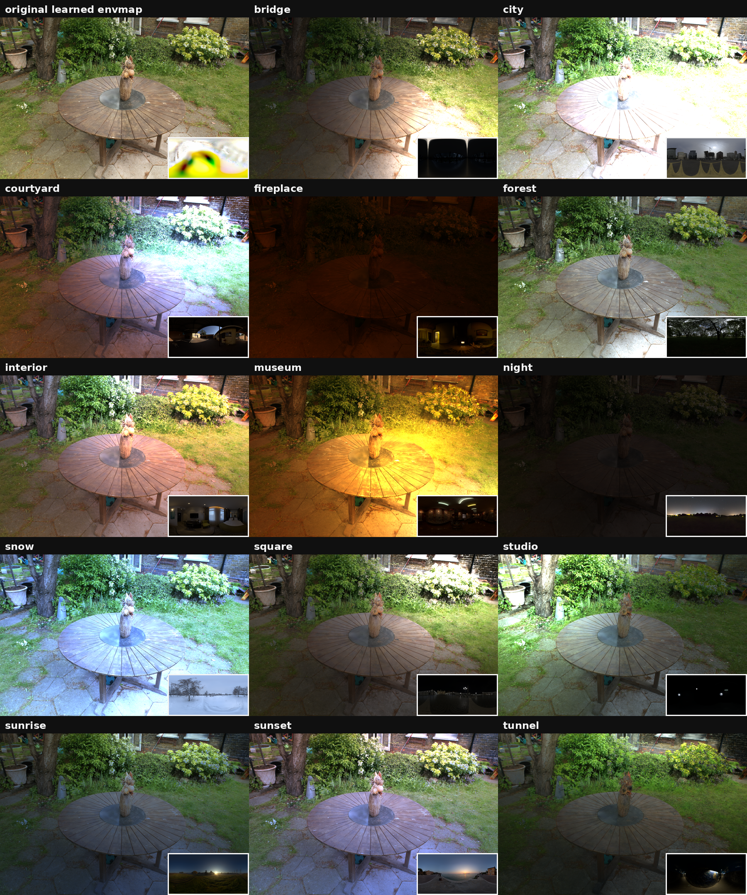

# GANG-Jittor-Render：基于计图的场景级可重光照神经高斯渲染器

GANG-Jittor-Render 在计图深度学习框架与 JGaussian 渲染库的基础上，实现 GANG 的完整推理管线，贯通模型转换、场景渲染与重光照流程。完成权重转换后，渲染与重光照无需安装 PyTorch 和 nvdiffrast，即可在计图环境中独立运行。

我们针对复杂场景优化光照计算。在同一块 NVIDIA RTX 4090 上，计图渲染器保持了与 PyTorch 原版接近的平均重建质量，完整前向耗时从 **87.83 ms/帧降至 59.63 ms/帧**，推理速度达到 **16.77 FPS**，显存采样峰值降低约 **40.6%**。测试条件与复现入口见下文。



固定模型、材质与相机，仅替换环境贴图。第一格为模型学习到的环境光，其余为 14 张 TensoIR HDR；右下角展示实际使用的环境贴图。该展示关闭 SG 与点光源，采用固定线性裁剪显示，外部 HDR 的能量差异可能造成高亮截断。

## Part 1 从 3DGS 到场景级可重光照

### 1.1 场景级重光照的挑战

三维高斯泼溅（3DGS）在实时新视角合成上表现出色，但直接存储与视角相关的颜色，难以分离几何、材质与光照。计图高斯库 JGaussian 已在物体和人像重光照等方向取得进展；面对材质多样、结构复杂的真实场景，逐高斯存储材质参数仍面临存储开销大、局部材质一致性不足等挑战。

GANG（Geometrically-Aligned Neural Gaussians）将锚点式神经高斯表示与物理真实感渲染结合，实现复杂真实场景的高质量可重光照重建。该方法支持编辑场景材质与照明条件，相关论文发表于 IEEE TVCG 2026。


### 1.2 GANG 渲染管线的核心架构

GANG 以锚点组织场景，由轻量级 MLP 将紧凑特征解码为多个神经高斯的几何与 PBR 材质属性。同一锚点内的高斯共享特征和解码器，保持局部材质一致性。论文在三个数据集上的效率实验中，模型存储量平均约为 R3DG 的 1/25。

渲染时，解码器结合视线方向与距离生成高斯属性，光照模块根据材质和照明计算颜色，再经光栅化合成图像。


GANG 将 cubemap 环境光与球面高斯（SG）局部光照结合。环境贴图提供整体照明，SG 根据场景位置描述局部光照，补充方向性高光与明暗变化。两类光照结合 Cook–Torrance 材质模型计算漫反射和镜面反射，使不同材质呈现相应的光泽与反射特征。


## Part 2 计图渲染管线的实现与优化

### 2.1 从预训练模型到计图推理

本项目复用 JGaussian 的 CUDA 光栅化器框架、环境光模型与 BRDF 查找表积分（FG_LUT）等基础能力，接入 GANG 所需的材质与光照分量。推理路径直接调用 CUDA 前向，不建立 Tape，也不保留反向传播缓存；按阶段释放中间张量，减少多视角渲染的显存占用。

仓库提供 `.pth → .npz` 转换工具，配套转换原版 GANG PBR 模型与灯光状态。已有预训练权重完成格式转换后，即可载入计图渲染器，无需重新训练。转换阶段需要 PyTorch，推理阶段不需要。支持的检查点结构、LOD 元数据与使用方式见 [检查点转换说明](docs/checkpoint_conversion.md)。

### 2.2 锚点式 PBR 材质解码

为适配 GANG 的锚点式表示，我们在计图中实现了几何与材质解码器，将锚点特征与视线方向、距离等信息组合，分别预测高斯的几何属性与反照率、粗糙度、金属度等材质参数。解码结果直接衔接光照计算与光栅化，使锚点式场景表示能够在计图中完成 PBR 渲染。

### 2.3 混合光照实现与 SG 计算优化

计图实现衔接环境光预积分与 SG 局部光照计算：由 cubemap 生成漫反射辐照度图和镜面反射预过滤 mipmap，同时计算 SG 对场景不同位置的光照贡献，再结合材质参数完成着色。

我们以专用 CUDA 算子优化 SG 光照中的三分量点积与范数计算，在保留原有 FP32/FP64 精度、epsilon 和 clamp 的同时提升推理速度。

优化后端为 `vector3_cuda`，仅用于推理。普通可视化入口默认仍为 `native`，需显式开启优化；实测入口 `tools/render_measured.py` 已选择 `vector3_cuda` 和对应参数。详见 [SG 三分量归约说明](docs/sg_vector3.md)。

### 2.4 计图原生环境纹理采样与重光照

原版 GANG 使用 nvdiffrast 完成环境纹理查询。我们在计图中实现所需的纹理采样，支持二维纹理、cubemap 跨面插值与多级 mipmap 查询，兼顾环境光照的连续性和不同粗糙度下的镜面反射表现。

该实现既能还原模型学习到的环境光，也支持替换外部 HDR 环境贴图，呈现场景在不同照明条件下的材质与光影变化。渲染运行时不再依赖 PyTorch 或 nvdiffrast；CUDA 高斯光栅库仍需按下文从源码编译。

## Part 3 渲染质量与推理速度

测试在同一块 NVIDIA RTX 4090 上进行，两种渲染器加载相同模型，以相同分辨率渲染 24 个固定视角。每种实现独立运行三次，每次预热两轮、计时五轮，累计采集 360 帧数据。完整前向在每帧结束时同步设备，不插入分段同步；计时排除模型加载、编译、预热和图像保存。

本次使用 Garden 40K 模型、全部 597027 个锚点、PBR 与 16 个 SG，固定 `res=4`，输出为 1297×840。计图版本为 1.3.11.0，采用 `vector3_cuda` 后端与 `flattened` offset 布局。

### 3.1 渲染质量

以相同缩放方式处理的真实图像（GT）为参考，汇总 24 个视角的平均结果：

| 指标 | PyTorch 原版 | 计图渲染器 |
| --- | ---: | ---: |
| PSNR ↑ | 28.342778582 dB | 28.342778142 dB |
| SSIM ↑ | 0.897338535 | 0.897338543 |
| LPIPS ↓ | 0.073406972 | 0.073407122 |

PSNR 衡量像素误差，SSIM 衡量结构相似性，均越高越好；LPIPS 衡量感知差异，越低越好。三项指标均以真实图像为参考，并非两种渲染器输出之间的直接误差。LPIPS 的具体评估配置见 [实测说明](docs/measured_inference.md)。

### 3.2 推理性能

完整前向包含高斯生成、材质与光照计算以及光栅化。

| 指标 | PyTorch 原版 | 计图渲染器 | 改善幅度 |
| --- | ---: | ---: | ---: |
| 完整前向耗时 | 87.83 ms/帧 | 59.63 ms/帧 | 降低 32.1% |
| 推理速度 | 11.39 FPS | 16.77 FPS | 提升 47.3% |
| 显存采样峰值 | 8.126 GiB | 4.829 GiB | 降低 40.6% |

完整前向耗时是生成一帧所需的计算时间，FPS 表示每秒可生成的帧数；显存采样峰值是测试期间采样记录的最高显存占用。

测试表明，在上述条件下，计图渲染器保持了与 PyTorch 原版接近的平均重建质量，同时降低完整前向耗时与显存占用，为场景级重光照提供更高效的推理支持。

以上为固定测试环境下的实测结果。完整统计、逐帧记录、独立光栅器与 RGB-only 路径的结果，以及复现条件见 [实测版本说明](docs/measured_inference.md) 和 [原始统计](docs/benchmarks/20260908/three_run_summary.json)。不同 GPU、驱动与软件环境下的速度可能不同。

## 快速开始

以下命令均从仓库根目录执行。模型、场景数据、第三方 HDR 和预编译动态库不随源码分发。

### 安装与构建

使用 Linux/WSL 的计图 CUDA 环境，需要 CUDA Toolkit、C++ 编译器及 CMake。实测环境为 RTX 4090，构建时使用 SM 89；其他显卡应选择对应架构。

```bash
pip install -r requirements.txt
pip install nvidia-ml-py
GANG_CUDA_ARCHS=89 bash submodules/light_gaussian/_rebuild.sh stable
```

### 复现实测推理

权重目录需包含实测使用的 `model.npz` 与 `outputs.log`，后者提供对应模型的 LOD 参数。固定相机清单已包含在仓库中；只渲染和测速无需 GT 图片，对 GT 评价质量时才需要原始图像。

```bash
# 先检查三个固定视角。
python tools/render_measured.py --weights /path/to/garden_40k \
  --output outputs/measured_smoke --smoke --rounds 1

# 完整前向：两轮预热、五轮计时。
python tools/render_measured.py --weights /path/to/garden_40k \
  --output outputs/measured_full_A
```

输出目录存在时拒绝覆盖。重复测试请使用新的 B、C 目录。该入口用于固定实验复现，不能任意替换模型结构或检查点格式。PyTorch 对照环境和历史模型的材质参数顺序见 [实测说明](docs/measured_inference.md)。

### 转换权重与渲染

转换器支持文档列出的原版 GANG PBR capture、配套灯光和显式 LOD 元数据，不支持任意 PyTorch 模型，也不用于跨框架续训。请先按 [检查点转换说明](docs/checkpoint_conversion.md) 准备输入并确认材质参数顺序。

建议在已安装 PyTorch 和 NumPy 的独立环境中执行转换命令，生成 NPZ 后，再切换到计图推理环境执行渲染命令。上文的安装步骤仅配置计图推理环境。

```bash
# 在 PyTorch 转换环境中执行。
python tools/convert_pytorch_checkpoint.py \
  --checkpoint /path/to/chkpnt40000.pth \
  --light /path/to/Hybridlight40000.npy \
  --metadata /path/to/metadata.json \
  --output /path/to/model_named.npz \
  --trust-pickle

# 切换到计图推理环境后执行。
python tools/render_learned_light.py \
  --model-npz /path/to/model_named.npz \
  --camera-json /path/to/cameras.json \
  --views '0 1 2' --res 4 --base-res 256 \
  --sg-reduce-backend vector3_cuda \
  --output-dir outputs/learned_light
```

仅对可信文件使用 `--trust-pickle`。相机 JSON 需另行提供，`--views` 指相机数组下标；`--res` 应与模型训练分辨率匹配，`--base-res` 应与灯光 cubemap 尺寸匹配。此可视化入口使用 ACES 显示变换，不替代实测入口。

### 替换环境贴图

以下示例固定几何、材质与相机，关闭 SG 和点光源，只替换 cubemap。第三方 HDR 可从原版 GANG 引用的 [TensoIR envmap 归档](https://drive.google.com/file/d/10WLc4zk2idf4xGb6nPL43OXTTHvAXSR3/view) 获取。

```bash
python tools/relight_envmap.py \
  --model-npz /path/to/model_named.npz \
  --camera-json /path/to/cameras.json \
  --views '120' --comparison-view 120 \
  --res 4 --base-res 256 \
  --hdr-path /path/to/night.hdr \
  --replacement-label night \
  --scene-output paper_linear_clamp \
  --output-dir outputs/envmap_night
```

示例下标 120 对应首页实验的 DSC08066；更换相机清单时应核对下标。脚本保存图像、线性 HDR 数组、A/B 对比图和参数记录。批量替换 HDR 时建议每张使用独立进程与输出目录，避免多套环境纹理同时驻留显存。

## 使用范围

- 本仓库提供推理与重光照工具，不提供完整训练入口。
- 普通可视化入口与固定测速入口具有不同的相机、显示和加载约定；复现 59.63 ms/帧对应的测试应使用 `render_measured.py`。
- 命名 NPZ 与旧 item-sequence NPZ 不可混用。模型未保存的 LOD 状态需要另行提供；转换器对 `_extra_level` 的处理见转换文档。
- 标准 SG 路径不计算遮挡可见性。点光源与阴影属于默认关闭的实验分支，不属于本页的质量与速度结论。
- 公开 PBR 入口保留原模型的法线约定，环境贴图替换不改变模型材质或法线。
- 当前许可证仅允许非商业研究和评估用途，具体条款见 [LICENSE](LICENSE)。

## 相关资料

GANG 方法：D. Li, S.-S. Huang, H. Fu, and H. Huang, *GANG: Geometrically-Aligned Neural Gaussians for Efficient and Realistic Relighting*, IEEE TVCG, 2026. DOI: [10.1109/TVCG.2026.3687668](https://doi.org/10.1109/TVCG.2026.3687668)。原版项目：[wanglids/GANG](https://github.com/wanglids/GANG)。

本工作复用了计图高斯库 [JGaussian](https://github.com/IGLICT/JGaussian) 的光栅化器框架与 PBR 基础组件。

GANG-Jittor-Render 与 JGaussian 均基于[计图深度学习框架](https://cg.cs.tsinghua.edu.cn/jittor/)开发。第三方组件归属与许可见 [THIRD_PARTY_NOTICES.md](THIRD_PARTY_NOTICES.md)。
